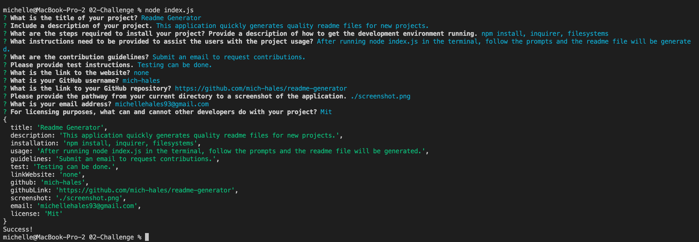

# **README File Generator**
    

## Description
When creating an open source project on GitHub, it’s important to have a high-quality README for the app. This should include what the app is for, how to use the app, how to install it, how to report issues, and how to make contributions.

This is a command-line application that runs with Node.js to generate a quality README.md file based on input about your project. Check out the `MockupREADME.md` in this repository as an example. 

## Table of Contents
- [Description](#Description)
- [Installation](#Installation)
- [Usage](#Usage)
- [License](#License)
- [Contributing](#Contributing)
- [Tests](#Tests)
- [Questions](#Questions)

## Installation
To generate your own README, open your terminal and navigate to the folder of your project.

Run `npm install` in order to install the npm package dependencies as specified in the `package.json`. `inquirer` will prompt you for your inputs from the command line. 

This application will start by running `node index.js` from the command line. Follow the prompts to generate the README file. 

After answering all the prompts, your README file will be named 'MockupREADME.md' and will be ready for you at the root of the repository. 

## Usage
When you run `node index.js`, the application uses the inquirer package to prompt you in the command line with a series of questions about your project. `fs.writeFile` is then used to generate your project's README.md file. 

## License
MIT: https://opensource.org/licenses/MIT
    
## Contributing

## Tests

## Questions
* If you have any addition questions, you can contact me here: michellehales93@gmail.com

## Links
* Link to GitHub Repository: https://github.com/mich-hales/readme-generator#Questions
* Link to GitHub: https://github.com/mich-hales

## Mockup
